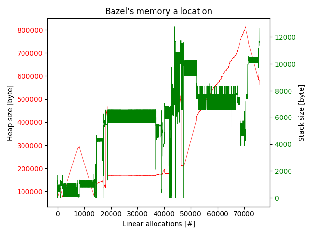

# Plotting memusagestat's data

`memusage` is a great tool to track all allocations for a program,
this comes to many Linux distributions with `glibc` itself.
So if you need a quick-and-easy allocation tracker `memusage` is the tool for you!
There is a plotter, `memusagestat` that can draw a simple image for you,
but it shows its age and is inconvenient to work with.
  This is a new parser and plotter for the `memusage` data
with easy-to-use python code and nice looking plots.
We have a knoweldge document describing it in detail: [here]


[here]: http://meroton.com/docs/captains-log/plotting-memusagestat-with-python/

## memusage & memusagestat

`memusage` is a good profiling tool bundled with `glibc` on Linux,
it tracks allocations for a program.
Its sibling `memusagestat` can plot the allocations,
which is interesting when looking at out-of-memory problems
and garbage-collection/memory thrashing.
The is good for an initial investigation,
there are few options for how to present the data
and the graph itself does not look very nice.
You can select to plot either by sequential allocation or by linear time.
We want to generate new,
nicer looking, figures
for the same data.

In this example use `memusage` to profile a `bazel` invocation that runs out of memory

```
$ memusage --data path/to/bazel.mem \
    bazel build ... \
    //...
```

and render a plot:

```
$ memusagestat bazel.mem -T -t
```


We can create the corresponding plot with the following command:

```
$ ./memusagestat.py --stack=same-scale --title "Bazel's memory allocation" bazel.mem bazel-allocation.png
```



The astute reader will notice that the stack axis differs slightly between the two plots.
We have not put our finger exactly on why,
some of it is probably the age old kilo-kibi byte confusion.
But there may be some subtleties in how `memusagestat` draws the plot,
with more direct graphing computations,
to our reading and parsing the python code is correct.
And the `maxsize_stack` is reported as 12752
(which is greater than 12k, 12288).
This is shown only in the python plot.

## Compare the data parsing

To make sure that we plot the correct data
we can compare and verify the parser against what the `memusagestat` c code parsers.
`memusagestat.py` can print the parsed entries from the allocation log file `bazel.mem` in our case.
Which can be compared to a patched oracle `memusagestat` from glibc.
Apply the patch in `0001-Oracle-Print-parsed-entries.patch`
and rebuild following the instructions [on our blog].

```
# Patch and re-compile glibc's malloc/memusagestat
$ export GLIBC=/home/nils/bin/gits/glibc/build/x86_64/malloc
$ $GLIBC/memusagestat -o static/original-memusagestat.png bazel.mem > reference
$ ./memusagestat.py --stack=different-scales --title "Bazel's memory allocation" --print-parsed-entries bazel.mem static/bazel-allocation.png > new-parser
$ diff new-parser reference
75913d75912
< Saved static/bazel-allocation.png
```

This gives us confidence in our parser, and standard `matplotlib` plots.

[on our blog]: https://meroton.com/docs/captains-log/Plotting-memusagestat-with-python/#building-memusagestat-and-glibc
